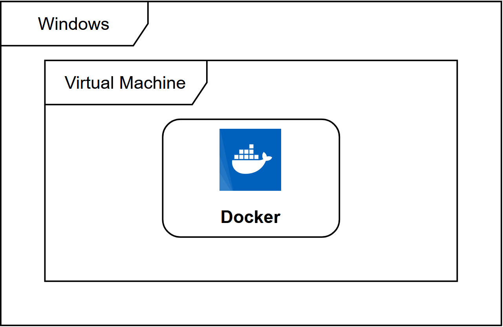
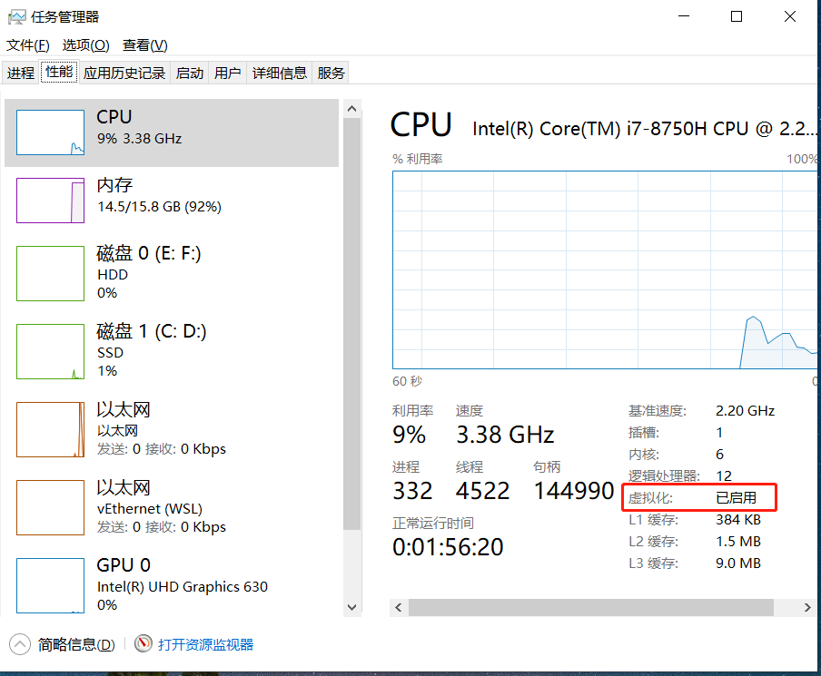

# Docker
容器 ≠ Docker，Docker 只是 CRI 的一种实现。Kubernetes 从 v1.20 开始弃用 Docker，并推荐用户切换到containerd、cri-o 等。

## Win10 安装Docker
> Docker 并非是一个通用的容器工具，它依赖于已存在并运行的 Linux 内核环境。<br/> 
Docker 实质上是在已经运行的 Linux 下制造了一个隔离的文件环境，因此它执行的效率几乎等同于所部署的 Linux 主机。<br/>  
因此，Docker 必须部署在 Linux 内核的系统上。如果其他系统想部署 Docker 就必须安装一个虚拟 Linux 环境。<br/>

在 Windows 上部署 Docker 的方法都是先安装一个虚拟机，并在安装 Linux 系统的的虚拟机中运行 Docker。

### 开启虚拟化

如果没有启用虚拟化，则可以通过安装 Hyper-V 开启
```shell
Enable-WindowsOptionalFeature -Online -FeatureName Microsoft-Hyper-V -All
```

### 安装 Dokcer Desktop
官方下载地址： https://docs.docker.com/desktop/install/windows-install/

双击  一路 Next 直至安装完成。重启电脑后生效。
