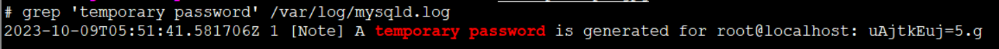

# MySQL

- [表结构同步](./mysql-schema-sync.md)

## 下载+安装
从最新版本的linux系统开始，默认的是Mariadb而不是mysql!!！ <br>
下载RPM，可以前往[MySQL官网](http://dev.mysql.com/downloads/repo/yum/)进行下载
```shell
#5.7
wget http://dev.mysql.com/get/mysql57-community-release-el7-8.noarch.rpm
#5.6
wget http://repo.mysql.com/mysql-community-release-el7-5.noarch.rpm
```
导入Yum库
```shell
yum localinstall mysql57-community-release-el7-8.noarch.rpm
#或者
rpm -ivh mysql-community-release-el7-5.noarch.rpm
```
安装
```shell
yum install mysql-community-server
```

## 启动+开机自启
```shell
systemctl start mysqld
systemctl status mysqld
systemctl enable mysqld
systemctl daemon-reload
```

## 重置root密码
5.6默认无密码，先无密码登录
```shell
mysql -u root
```
5.7会在/var/log/mysqld.log文件中给root生成了一个默认密码
```shell
grep 'temporary password' /var/log/mysqld.log
```

用上面的临时密码登录
```shell
mysql -uroot -puAjtkEuj=5.g
```
再修改密码
```sql
ALTER USER 'root'@'localhost' IDENTIFIED BY 'yourpassword';
```
或者
```sql
use mysql;  
update user set password=password('yourpassword') where user='root' and host='localhost';  
flush privileges;  
```

## 授权root用户远程登录
```sql
grant all privileges on *.* to 'root'@'%' identified by 'yourpassword' with grant option;  
flush privileges;
```

## 创建用户并授权
```sql
CREATE USER 'username'@'%' IDENTIFIED BY 'password';
GRANT ALL ON dbname.* TO 'username'@'%';
FLUSH PRIVILEGES;
```

## MySQL的一些常用的默认文件路径
```txt
配置文件：/etc/my.cnf 
日志文件：/var/log//var/log/mysqld.log 
服务启动脚本：/usr/lib/systemd/system/mysqld.service 
socket文件：/var/run/mysqld/mysqld.pid
```

## FAQ
- 多版本包冲突
  ```txt
  error: Failed dependencies:
	  mysql-community-release conflicts with (installed) mysql57-community-release-el7-8.noarch
	```
	解决方法
	```shell
	rpm -e --nodeps mysql57-community-release
	```
- GPG key
  ```txt
	GPG key retrieval failed: [Errno 14] curl#37 - "Couldn't open file /etc/pki/rpm-gpg/RPM-GPG-KEY-mysql"
	```
	解决方法: https://dev.mysql.com/doc/refman/5.7/en/checking-rpm-signature.html
	```shell
	rpm --import https://repo.mysql.com/RPM-GPG-KEY-mysql-2022
	```