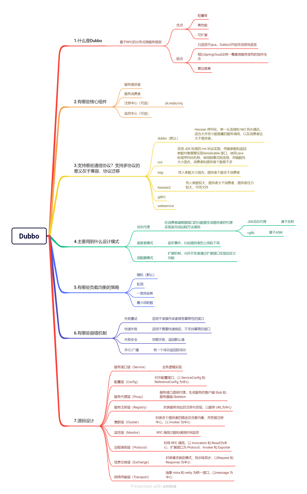

# Dubbo
高性能、轻量级的开源 RPC 框架。[官网地址](https://cn.dubbo.apache.org/zh-cn/)


## 看源码之前没想到的
- dubbo协议本身也是通过扩展点实现的
- 消费者没有xxx-api.jar也可以通过 GeneralService 用 Map 构造接口和参数进行远程调用

## Dubbo + K8S 遇到的问题

### HostNetwork 的问题

任何技术变革都不可能一步到位，所以难免出现集群内的提供者需要为集群外的消费者提供服务的情况，那么提供者注册到 zk 的 ip:port 不能是podIP，因为podIP只对集群内可见。最简单粗暴的办法就是使用 HostNetwork 的方式部署提供者。这样就导致不得不使用 dubbo 随机端口的机制以避免端口冲突的问题，且提供者和消费者必须依赖同一个注册中心。这样虽然能解决问题，但是降低了隔离性和可移植性，违背了应用上 k8s 的初衷。

经过分析 dubbo 源码得知可以通过添加环境变量 DUBBO_IP_TO_REGISTRY 和 DUBBO_PORT_TO_REGISTRY 能改变注册到 zk 的 ip:port。以下例子都以默认端口 20880 启动提供者。

如果在本机启动，本地 ip 是 192.168.1.1，在启动 Provider 之前添加如下代码，则 dubbo-admin 看到的提供者是 192.168.1.2:20881，前提是 192.168.1.2:20881 和 192.168.1.1:20880 互通。
```java
System.setProperty("DUBBO_IP_TO_REGISTRY","192.168.1.2");
System.setProperty("DUBBO_PORT_TO_REGISTRY","20881");
```
如果部署在 k8s 集群，则添加如下环境变量，其中 30001 为 pod 对应的 svc nodeport。
```yaml
env:
  - name: DUBBO_IP_TO_REGISTRY
    valueFrom:
      fieldRef:
        apiVersion: v1
        fieldPath: status.hostIP
  - name: DUBBO_PORT_TO_REGISTRY
    value: '30001'
```
上面虽然实现了改变了注册中心提供者的 ip:port，但是当消费者调用接口时却出现了 Not found exported service: xxx 异常。继续分析源码，得知问题出现在 com.alibaba.dubbo.rpc.protocol.dubbo.DubboProtocol.getInvoker 方法。针对这个问题我提了一个 [issue](https://github.com/apache/dubbo/issues/12798)

**问题原因**：添加了 DUBBO_IP_TO_REGISTRY 和 DUBBO_PORT_TO_REGISTRY 之后，提供者以 serviceKey=xxx.xxxService:30001 作为 key 将提供者实例保存在 exporterMap 里面，但是当消费者发起远程调用去获取提供者实例时，却以 serviceKey=xxx.xxxService:20880 去 exporterMap 匹配。此时自然就出现 Not found exported service。

**解决方法**：通过 [协议扩展](https://cn.dubbo.apache.org/zh-cn/docsv2.7/dev/impls/protocol/) 修改 DubboProtocol
- 步骤1：添加 com.alibaba.dubbo.rpc.protocol.dubbo.XxxProtocol 类
- 步骤2：将原来 DubboProtocol 代码复制到 XxxProtocol
- 步骤3：在 getInvoker 添加如下代码
```java
Invoker<?> getInvoker(Channel channel, Invocation inv) throws RemotingException {
        boolean isCallBackServiceInvoke = false;
        boolean isStubServiceInvoke = false;
        int port = channel.getLocalAddress().getPort();
        String path = inv.getAttachments().get(Constants.PATH_KEY);
        // if it's callback service on client side
        isStubServiceInvoke = Boolean.TRUE.toString().equals(inv.getAttachments().get(Constants.STUB_EVENT_KEY));
        if (isStubServiceInvoke) {
            port = channel.getRemoteAddress().getPort();
        }
        //新增的代码-->begin
        String dubboPortToRegistry = ConfigUtils.getSystemProperty(Constants.DUBBO_PORT_TO_REGISTRY);
        if(StringUtils.isNotEmpty(dubboPortToRegistry)) {
        	port = Integer.valueOf(dubboPortToRegistry);
        }
        //新增的代码-->end
        //源码省略...
    }
```
- 步骤4：注册扩展协议，添加文件 src/main/resources/META-INF/dubbo/internal/com.alibaba.dubbo.rpc.Protocol 内容如下
```
xxx=com.alibaba.dubbo.rpc.protocol.dubbo.XxxProtocol
```
- 步骤5：修改提供者协议
```dubbo.protocol.name=xxx```
- 步骤6：修改消费者协议
```dubbo.protocol.name=xxx```

至此，接口终于能调通了，但是问题远没有结束。

虽然提供者的 ip:port 变成了 [hostIP]:[NodePort]，但是这个地址并不是和 pod 一一对应的，而是每一个[hostIP]:[NodePort]都指向了同一组微服务的集群，这样dubbo的负载均衡机制就失去了意义，且给全链路跟踪造成了困难，所以还必须实现一个[hostIP]:[NodePort]地址对应一个pod。

不管是用 [StatefulSet](https://kubernetes.io/docs/concepts/workloads/controllers/statefulset/) 还是用 [EndpointSlices](https://kubernetes.io/docs/concepts/services-networking/endpoint-slices/) 都不能解决所有 pod 只能用一个 NodePort 的问题。所以只能通过 CRD 自定义实现一个 pod 对应一个 svc nodeport。

至此，才能彻底避免提供者使用 HostNetwork 模式的部署。这个代价着实有点大，不到万不得已不建议使用，或许 dubbo3 或者 Service Mesh 能有更好的解决方案吧。
