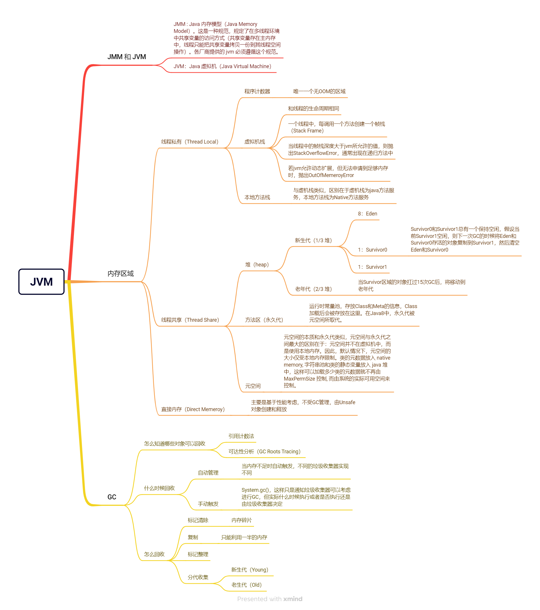

# JVM
Java Virtual Machine，用C++编写实现的，将java代码编译为class文件，再将class文件转化为对应操作系统的指令，完成java程序跨平台运行。


## 为什么要编译成class文件
理论上说，是可以将java代码直接编译成本地机器码，那为什么还要搞一个class文件的中间层呢？
1. **编译和执行分离**：加快跨平台部署
2. **节省内存**：class文件比java文件小的多，JIT去解析class文件比java文件要轻松高效的多
3. **支持反射**：实现动态加载和卸载，提高可扩展性

## 组成部分
1. **类加载器**：将class文件加载到内存
  - 启动类加载器（Bootstrap Class Loader）
  - 扩展类加载器（Extension Class Loader）
  - 应用程序类加载器 （Application Class Loader）
2. **运行时数据区**：其实就是内存划分
  - 线程共享
    - 方法区（Method Area）/元空间（Metadata Space）: 存放类信息，常量，静态变量
    - 堆（Heap）：最大的内存块，存放new出来的对象。分为新生代和老年代，默认占比为（1:2），新生代又分为一个Eden和两个Survival，默认占比（8:1:1）
  - 线程私有：随线程的生命周期创建销毁
    - 程序计数器（Program Counter）: 记录下一条指令的地址
    - 栈（Stack）：先进后出，存放局部变量，方法调用和返回信息等
    - 本地方法栈（Native Method Stack）
3. **执行引擎**：将class编译为本地机器指令
  - 解释器
  - 即时编译器（JIT）：识别热点代码，将热点代码转化为本地机器码，提高执行效率
4. **垃圾回收器（GC）**
  - Serial：单线程，一般用于新生代
  - Parallel：Serial的多线程版本
  - CMS：通过并发标记和并发清除的方式，减少了垃圾回收造成的应用停顿时间，一般用于老年代
  - G1：新一代的垃圾回收器，它适用于大内存应用，既关注新生代又关注老年代，通过分区和并发处理来减少应用停顿时间。
  - ZGC: 一种新型的低延迟垃圾回收器，旨在减少长时间的应用停顿，特别适用于对延迟要求较高的应用。

## 怎么识别对象可以被回收？
1. **引用计数器**
  - 强引用：不可被回收
  - 软引用：内存不足时可能被回收
  - 弱引用：无论内存是否足够，下一次GC被回收
  - 虚引用：可以被回收
2. **可达性分析（GC Root）**

## 为什么要调优？
1. **提高资源利用率**：虽然默认配置适应于大多数应用场景，但是不可能适用于所有场景，所有针对特殊场景调整配置将达到事半功倍的效果。
2. **减少GC的频率**：尤其是Full GC，因为GC会暂停所有正在运行的线程（STW），造成卡顿，严重影响用户体验。
3. **发现问题代码**：常见的像死锁，死循环，大对象

## 查看进程的jvm参数配置
```shell
jps -l
jinfo <pid>
```

## 设置堆内存
```txt
-Xms2g 设置JVM的初始堆大小为2G
-Xmx4g 设置JVM的最大堆大小为4G
```
>常规建议
1. 内存密集型的（例如：报表，图像处理）堆内存应该设置大一点，而CPU计算型的（例如：网关，订单服务）堆内存可以小一点。
2. 建议初始值和最大值设置为一致，避免堆内存频繁的释放和开辟内存空间带来的性能消耗产生的不稳定性。
3. 建议堆内存大小占主机物理内存的50%~80%，太小会导致频繁gc，太大会导致gc停顿时间变长，且可能导致系统其它进程资源不足。

## 垃圾回收配置
- -XX:+UseSerialGC：使用串行垃圾回收器。
- -XX:+UseParallelGC：使用并行垃圾回收器。
- -XX:+UseConcMarkSweepGC：使用并发标记-清除垃圾回收器。
- -XX:+UseG1GC：使用G1（Garbage-First）垃圾回收器。
- -XX:NewRatio=2：设置新生代与老年代的比例为1:2。
- -XX:SurvivorRatio=8：设置Eden区与Survivor区的比例为8:1:1。
- -XX:MaxGCPauseMillis=200：设置期望的最大垃圾回收停顿时间为200毫秒。
- -Xlog:gc:<options>：启用GC日志，可以设置日志的输出选项。

## 发生OOM时自动生成dump文件
- -XX:+HeapDumpOnOutOfMemoryError：发生内存溢出时生成Heap Dump文件。
- -XX:HeapDumpPath=/path/to/dump/files：设置Heap Dump文件的路径。

## arthas 阿里开源的java程序诊断工具
[文档地址](https://arthas.aliyun.com/)