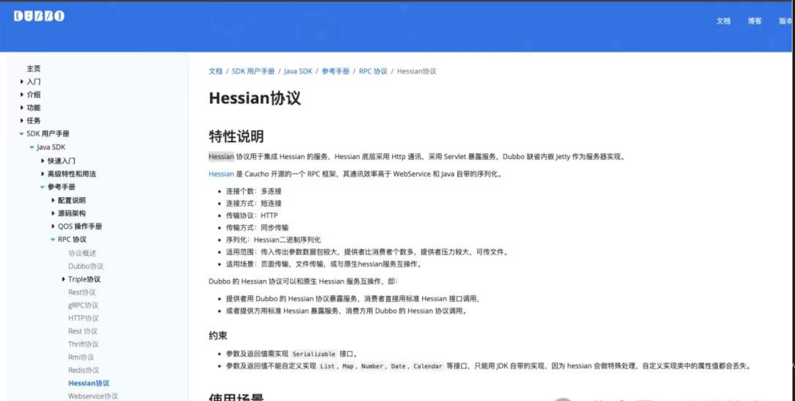
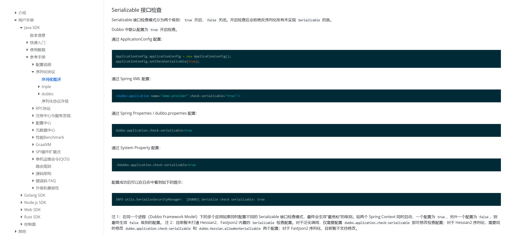

# Java 基础

## 主要特性
- **跨平台**：java是解释型语言，先由前端编译器例如（javac）将.java翻译为.class，再由后端编译器（jvm）翻译为机器语言，实现一次编译到处运行。
- **面向对象**：继承、封装、多态三大基本特征，单一职责、依赖倒置、开放封闭、接口隔离、里氏替换五大基本原则。
- **自动垃圾回收**：标记清除，复制，分代收集 

## 多线程

### CompletableFuture
CompletableFuture 是 java 8 引入的新特性，它使得异步编程和多任务组合编排变得更容易。
- get 和 join 的区别
  > 相同点
    1. 都会阻塞线程等待 future 返回结果
    2. 如果计算被取消抛出异常：CancellationException
  
  > 不同点
    1. get 需要显示的处理异常
    2. get(long timeout, TimeUnit unit) 方法可设置任务阻塞超时时间
- allOf 和 anyOf
  - allOf：所有任务都完成后才返回，因为每个任务返回结果的类型可能不同，所以只能用 CompletableFuture<Void> 接收。
    > 那如何获取所有任务的返回值呢？
    ```
    CompletableFuture<Void> allFuture = CompletableFuture.allOf(futures.toArray(new CompletableFuture[futures.size()]));
    CompletableFuture<List<Object>> resultFutures = allFuture.thenApply(v -> {
      return futures.stream().map(f -> f.join()).collect(Colletors.toList());
    });
    ```
  - anyOf：任意一个任务完成后即返回（一般是执行最快的那个），其他则丢弃，并返回 CompletableFuture<Object>。

## 序列化、反序列化

### Serializable 接口作用
Serializable 接口用于标识一个类的对象可以被序列化和反序列化。序列化是将对象转换为字节流，以便在网络上传输或保存到文件中。反序列化是将字节流恢复为对象。序列化的类中所有的属性也必须是可序列化的，或者可以使用 transient 关键字来标识某个字段不参与序列化。

### serialVersionUID 作用
serialVersionUID 是 Java 中用于标识类版本的一个唯一标识符，用在序列化和反序列化过程中。它的主要作用是确保序列化对象在反序列化时与类定义匹配，以防止反序列化过程中发生 InvalidClassException 异常。<br/>
如果不显示指定 serialVersionUID ，会自动生成一个值，无论改动了什么，重新编译后会生成一个新的值，此时会导致反序列化失败。<br/>
例如：
```java
public class Person {
    
    private String name;
    private int age;

    public Person(String name, int age) {
        this.name = name;
        this.age = age;
    }

    // Getters and Setters
}
```
此时我序列化Person对象，并保存到文件中，然后修改Person类
```java
public class Person {
    
    private String name;
    private int age;
    private String address;

    public Person(String name, int age, String address) {
        this.name = name;
        this.age = age;
        this.address = address;
    }

    // Getters and Setters
}
```
添加 address 字段，再将原来保存的文件反序列化，就会报 InvalidClassException 异常，因为反序列化时，Person类的serialVersionUID与序列化时生成的值不一致。所以为了能兼容这种情况，我们必须手动指定 serialVersionUID。
```java
import java.io.Serializable;

public class Person implements Serializable {
    private static final long serialVersionUID = 1L;
    
    private String name;
    private int age;
    private String address;

    public Person(String name, int age, String address) {
        this.name = name;
        this.age = age;
        this.address = address;
    }

    // Getters and Setters
}
```

### 为什么在 SpringBoot 中不实现 Serializable 接口也不会报错？
因为 Spring 默认使用的是 JSON 序列化 (Jackson)，而不依赖 Serializable 接口实现序列化和反序列化。而像 RMI 远程调用则需要实现 Serializable 接口。

### 为什么 Dubbo 默认不是 java 原生序列化方式，也需要实现 Serializable 接口？
Dubbo 默认的序列化方式不是 Java 原生的序列化方式，而是使用 Hessian 序列化方式。

在 Hessian 序列化方式中，对象必须实现 Serializable 接口，否则会抛出异常。
```java
cause: org.apache.dubbo.common.serialize.SerializationException: com.alibaba.fastjson2.JSONException: not support none serializable xxx
```
原因是 dubbo 默认开启了 Serializable 接口检查机制，可以通过 dubbo.application.check-serializable=false 属性关闭。
