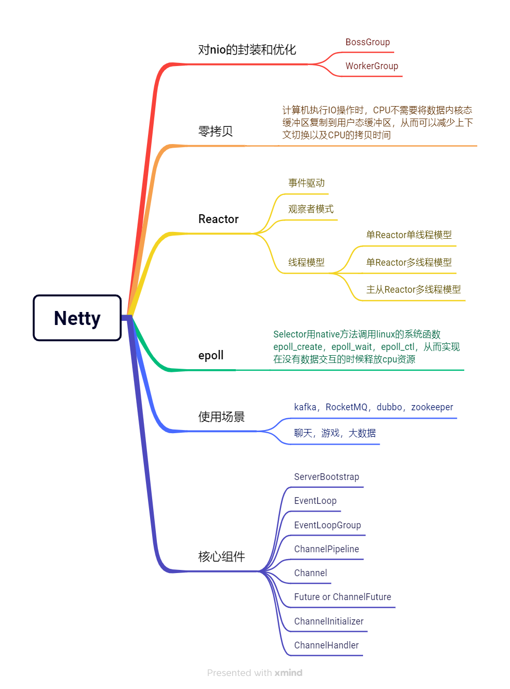

# Netty
Netty 是一款开源的、高性能、简单易用、功能强大的网络编程框架。[Github地址](https://github.com/netty/netty)

## 如何解决粘包、拆包问题？

### 什么是 TCP 粘包、拆包问题？
TCP 是以字节流的方式进行通信的，发送消息的时候会根据缓冲区的大小进行分段，如果消息体过大则会被拆分成多个数据包分批发送，如果消息体过小会将多个小的消息合并成一个大的数据包再发送。这样就产生了粘包、拆包的问题。

### 通常的解决方案
- 定长解码器 FixedLengthFrameDecoder
  > 这个解码器按照指定的长度对接收到的数据进行分割。如果接收到的数据长度小于指定长度，它会等待直到收集到足够的数据。

- 行分隔符解码器 LineBasedFrameDecoder
  > 它根据行分隔符(如\n或\rn)来处理粘包和拆包问题。这个解码器会按行分隔数据。

- 分隔符解码器 DelimiterBasedFrameDecoder
  > 这个解码器允许指定一个或多个分隔符。当遇到分隔符时，它将数据分割成一个个完整的帧。

- 长度字段解码器 LengthFieldBasedFrameDecoder
  > 这是一种更复杂的解决方案,适用于更复杂的协议。在这种方式中，消息中包含表示消息长度的字段。解码器根据这个长度字段来确定每个消息的边界。

- 自定义解码器
  > 如果预定义的解码器不满足需求，Netty还允许开发者实现自定义的解码器。通过扩展ByteToMessageDecoder类，可以处理任何复杂的粘包和拆包场景。