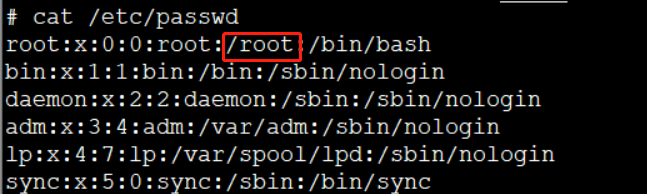

## 创建用户并授权
新建用户mayun并指定用户根路径为/home/mayun，且在/home/mayun目录下有读写权限
```shell
useradd -d /home/mayun mayun
passwd mayun
chown -R mayun:mayun /home/mayun
```

## chgrp,chmod,chown
转变文件所属用户组
```shell
chgrp -R 用户名 文件名
```
转变文件拥有者
```shell
chown -R 用户名 文件名
```
变动文件属性
```shell
chmod +x 文件名
```

## 修改用户登录后进入的目录

### 方法1
切换到root用户，使用usermod命令，使用该命令请确保该用户下没有运行的软件或进程
```shell
usermod -d /yourpath yourusername
```
### 方法2
如下图所示，将/root改为/yourpath，root用户登录后默认进入的就是/yourpath了

### 方法3
```shell
vim ~/.bashrc
```
添加 
```text
cd /yourpath
```
```shell
source ~/.bashrc
```

## 删除用户
- 删除用户和用户主目录下所有文件，不加-r删除用户文件不删除
```shell
userdel -r <要删除用户名>
```
- 删除用户组
```shell
groupdel <要删除用户组>
```
