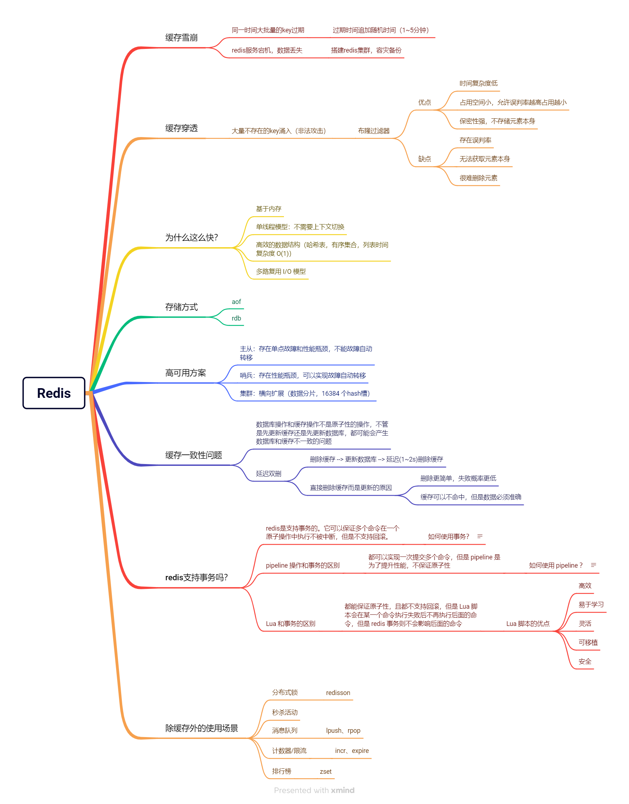

# Redis


## 方式1：yum 安装

### 安装epel仓库
安装epel源，CentOS默认的安装源在官方的centos.org上，而redis在第三方的yum源里，因此无法安装。
非官方的yum推荐用fedora的epel仓库。epel (Extra Packages for Enterprise Linux)是基于Fedora的一个项目，该仓库下有非常多的软件，建议安装  
```shell
yum install epel-release
```

### 安装redis命令
```shell
yum install redis
```

### 查看Redis安装了哪些文件
```shell
find / -name "redis*"
```

### 启动Redis服务
```shell
service redis start
```

### 查看redis启动状态
```shell
service redis status
```

### 打开Redis客户端
```shell
redis-cli
```

### 修改配置文件/etc/redis.conf
1. 允许远程访问redis，除需要开放服务器端口号6379，还需将配置文件中的bind 127.0.0.1注释掉，并且关闭保护模式protected-mode no
2. 设置连接密码，添加 requirepass xxx(你的密码)  

## 方式2：源码安装

### 下载
```shell
mkdir -p /opt/redis
cd /opt/redis
wget http://download.redis.io/releases/redis-4.0.6.tar.gz
tar -zxvf redis-4.0.6.tar.gz
```

### 安装
```shell
cd /opt/redis/redis-4.0.6
yum install gcc
make MALLOC=libc
cd src
make install
```

### 启动
直接启动
```shell
./redis-server
```
后台进程方式启动
```shell
#编辑/opt/redis/redis-4.0.6/redis.conf文件，并设置daemonize yes。设置后启动如下命令
./redis-server ../redis.conf
#如果要开启远程连接，redis.conf需要注释bind 127.0.0.1和关闭保护模式protected-mode no
```

## FAQ
异常日志
```txt
WARNING you have Transparent Huge Pages (THP) support enabled in your kernel. This will create latency and memory usage issues with Redis. To fix this issue run the command 'echo never > /sys/kernel/mm/transparent_hugepage/enabled' as root, and add it to your /etc/rc.local in order to retain the setting after a reboot. Redis must be restarted after THP is disabled.
```
在/etc/rc.local 添加如下代码 
```shell
if test -f /sys/kernel/mm/transparent_hugepage/enabled; then  
    echo never > /sys/kernel/mm/transparent_hugepage/enabled  
fi
```
