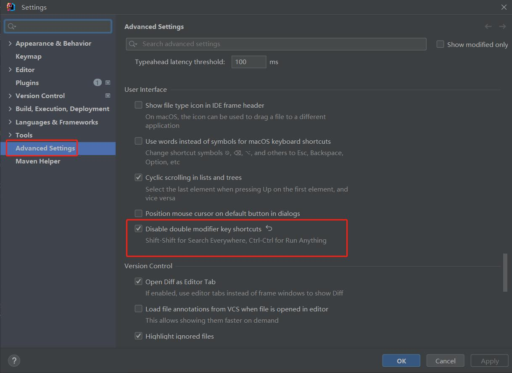
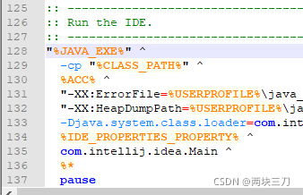

# IDEA 学习笔记

## 快捷键
虽然可以直接沿用Eclipse的快捷键，但是因为界面布局差异较大，也并不是所有都兼容，用起来还是别扭，所有建议使用标准的快捷键模式，这里以Windows为例。如果快捷键不生效一般是与其他软件冲突了。 
***设置Keymap***
<pre>
File -> Settings -> Keymap
</pre>

***查找***

| **操作** | **描述** |
| :---: | :---: |
| Ctrl + Shift + F | 全局文件内容 |
| Ctrl + Shift + R | 全局文件内容 |
| Shift + Shift | 全局搜索类或者方法 |
| Ctrl + N | 查找class |
| Ctrl + Shift + N | 查找文件 |
| Ctrl + Shift + Alt + N | 查找方法 |

***编码***

| **操作** | **描述** |
| :---: | :---: |
| Ctrl + X | 删除当前行 |
| Ctrl + D | 复制当前行 |
| Ctrl + / | 行注释 |
| Ctrl + Shift + / | 块注释 |
| Ctrl + H | 展示类的层级关系 |
| Ctrl + F12 | 展示类结构（构造函数，成员变量，方法等） |
| Shift + F6 | 重构/重命名 (包、类、方法、变量、甚至注释等) |
| Alt + Enter | 导入包 |
| Ctrl + Alt + O | 删除无用的import |

***跳转***

| **操作** | **描述** |
| :---: | :---: |
| Alt + 上方向键 | 跳到当前类的上一个方法位置 |
| Alt + 下方向键 | 跳到当前类的下一个方法位置 |
| Ctrl + Alt + 左方向键 | 后退到上一次光标的位置 |
| Ctrl + Alt + 右方向键 | 前进到上一次光标的位置 |

***禁用 Shift+Shift ***  
对于中文用户，习惯了用Shift切换输入法，所以这个快捷键必须禁用，禁用方法如下图：

## 导入maven项目
<pre>
File -> New -> Module from Existing Sources
</pre>

## UTF-8编码
* 版本：2022.1.2  
在D:\Program Files\JetBrains\IntelliJ IDEA 2022.1.2\bin\idea64.exe.vmoptions 添加启动参数 
<pre>
-Dfile.encoding=UTF-8
</pre>

## FAQ
***遇到错误提示，不要急于关掉，要尽力去理解提示内容***

### IntelliJ IDEA 重装后无法启动 
* 问题描述  
卸载2019版本重装2022版本后，双击IDEA无反应
* 原因  
新版本不支持旧版本的破解方法，但是在卸载旧版的时候破解相关的文件没有移除，导致新版本无法启动
* 解决过程  
第一步：查看错误信息  
<pre>
1) 在安装目录下找到D:\Program Files\JetBrains\IntelliJ IDEA 2019\bin\idea.bat文件;
2) 然后编辑此文件，在最后一行添加 pause，用于报错后暂停；
3) 双击此文件运行，就可以查看错误信息了;
4) 看完错误信息，记得复原idea.bat
</pre>
  
第二步：删除残留文件夹
<pre>
1）删除旧版文件夹 C:\Users\用户名.IntelliJIdea2019
2）删除文件夹 C:\Users\用户名\AppData\Local\JetBrains
3）删除文件夹C:\Users\用户名\AppData\Roaming\JetBrains
</pre>
上面步骤完成后再双击IDEA就能正常启动了！

### 创建接口时报错
* 问题描述  
Unable to parse template "Interface" Error message: Selected class file name 'xxx.java' mapped to not java file type 'Files supported via TextMate bundles'  
* 解决过程  
第一步：  
在idea.exe.vmoptions和idea64.exe.vmoptions添加启动参数
<pre>
-Djdk.util.zip.ensureTrailingSlash=false
</pre>
然后重启   
第二步: 
<pre>
Settings->Editor->File Types->Text 找到xxx.java删掉
</pre>