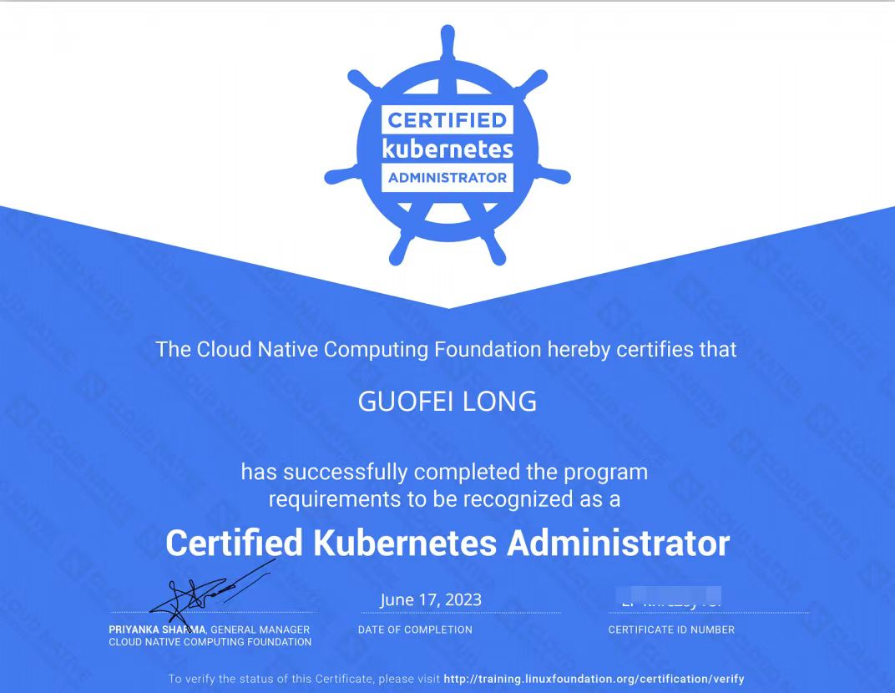

<!--hide.o-->
[点击这里下载这份简历（这可能需要大约10秒钟的时间，且不能显示图片）](https://tool.lgfei.com/v1/md/downloadResume)
<!--hide.c-->
## 个人信息

* 姓名：龙国飞
* 手机：18664571731
* 邮箱：longuofei@163.com
* GitHub：[https://github.com/lgfei](https://github.com/lgfei)
* 个人网站：[https://lgfei.com](https://lgfei.com)
* 工作年限：2014~至今

## 自我评价

有近10年的java开发经验，熟悉Spring和Dubbo框架体系的开发。近4年主要参与公司容器化改造以及devops平台的搭建与开发，对软件开发工具链比较熟悉，熟练掌握docker+k8s的部署与维护，熟悉常用数据库和中间件的使用以及维护，有golang，nodejs，shell实际开发经验。

喜欢研究新技术和编写开源软件，致力成为一名全栈工程师，始终保持对技术的热情，热衷于用自动化提高开发效率，不仅能独立完成项目也能够协调和领导团队完成项目。有良好的编码习惯，对于代码和文档整洁度有轻微的强迫症。

## 技能清单

* 编程语言：Java, Golang, Shell, NodeJS
* 技术框架：Spring, Spring Boot, Spring Cloud, MyBatis, Dubbo, React, Ant Design
* 开发工具：Linux, Eclipse, IDEA, VS Code, Goland, Git, Maven, Tomcat, Wrapper
* 容器化：Docker, Kubernetes, Harbor, Helm, kubebuilder
* 数据库：Mysql, Oracle, Redis, MongDB
* 中间件：Nginx, HAProxy, Zookeeper, Apollo, Kafka, Minio, Etcd, NFS, GlusterFS

## 技能认证
重要的不是最后的那张图片，而是过程中所激发的自主学习的能力。
* CKA (Certified Kubernetes Administrator)  
<!--hide.o-->

<!--hide.c-->

## 教育背景

* 2010.09-2014.06：长沙学院，信息与计算科学

## 工作经历

* **2018.05-至今：云盛海宏，架构师**
  - 参与产品规划和架构设计，负责核心组件开发和维护。
  - 带领开发与运维一起对基础组件和应用进行容器化落地实施。
  - 负责制定开发规范以及CI/CD流程设计与开发。
 

* **2016.09-2018.05：岚正科技，高级软件开发工程师**
  - xxx
 

* **2015.05-2016.09：赛意，java开发工程师**
  - xxx
 

* **2014.06-2015.05：软通动力，java开发工程师**
  - xxx

## 项目经验

* **HEDP：Devops效能管理平台**
  - **项目简介**：滔搏国际科技中心内部使用的研发效能管理平台，集成LDAP，Gitlab，Maven，Nexus，Sonarqube，Harbor，Gopub，Docker，Kubernetes，企微于一体组成一站式研发工作平台。拉通从需求设计 -> 代码管理 -> 测试 -> 构建部署 -> 运维全流程管理，实现整个研发生命周期的管理可视化，流程自动化。
  - **项目规模**：科技中心全体研发人员大约100，共托管大约140个微服务项目，平均每天产生的构建部署流水线200+。
  - **工作业绩**：领导各业务小组完成从虚拟机到k8s的改造和迁移，不仅节约了一半以上的硬件资源，且系统稳定性有了质的提升，彻底告别了午夜发版的噩梦。替代了原有的Jenkins，Jira，Kubesphere等工具，简化了研发流程，降低学习和沟通成本。
  - **关键技术**：各基础工具与Java对接技术，WebSocket，WebHook，Saga分布式事务模式

* **TPAS：开放接口网关平台**
  - **项目简介**：滔搏国际零售部门对外接口的业务网关平台。实现对外接口统一的入口，鉴权，日志，限流，熔断。根据接口数据自动生成接口文档以及接口流量统计报表。
  - **项目规模**：AppClient共计30+，对外接口共计230+，高峰期平均QPS达1900+，TPS达1800+。
  - **工作业绩**：解决了外部服务商与公司接口对接时多入口，多规范，相互耦合的混乱局面。推动对外接口统一命名及出参入参规范。解决内部服务直接暴露给第三方存在的安全隐患。
  - **关键技术**：Spring Cloud Gateway，Spring WebFlux，Spring Security，OAuth2.0，Hystrix，Redis

* **VDS：图片处理中心**
  - **项目简介**：滔搏国际基础服务之图片处理中心。以RPC的方式提供裁剪、旋转、缩放、组合、布局、抠图、拉伸、压缩等图片批量处理的接口。支持以模板的方式组合并固化一组操作，实现多步骤一键生成最终结果图。
  - **项目规模**：主要为公司内部的商品中台提供服务，再由商品中台为所有线上渠道的商品详情展示提供素材来源。
  - **工作业绩**：替代原有服务商（宝尊），降低成本，安全高效。推动各业务系统将已有的图片处理相关代码用统一的SDK替代。
  - **关键技术**：Netty，ImageMagic，动态代理+责任链+策略模式

## 个人项目
个人作品展览馆: https://lgfei.github.io/ 
* **WebChat: 网页版在线聊天室**
  - **项目描述**：房主创建一个房间，并设置房间容纳人数和房间密码，拿到房间链接和房间密码，无需登录注册即可加入聊天室。在通讯不便的情况下，以备不时之需。
  - **GitHub地址**：[https://github.com/lgfei/webchat](https://github.com/lgfei/webchat)
  - **技术栈和工具**：Java, Spring Boot, MyBatis, Mysql, HTML, CSS, JavaScript, Maven, Git
