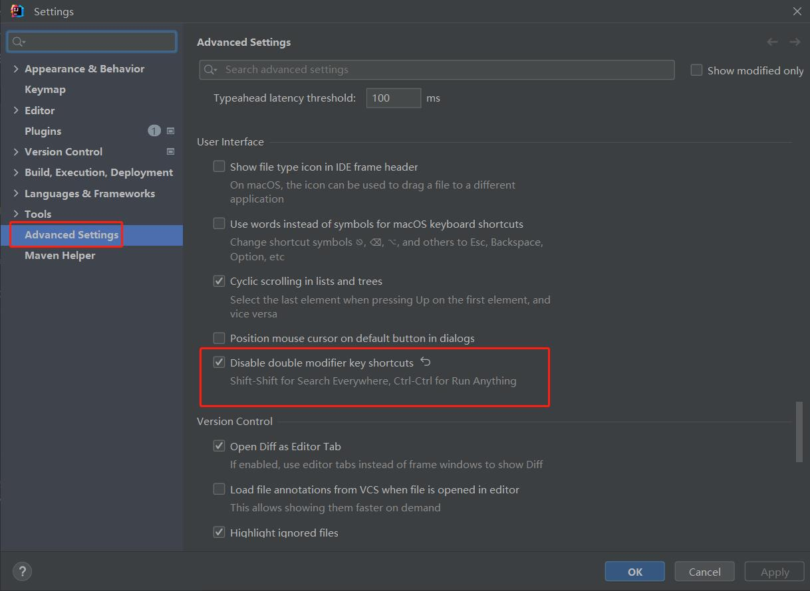
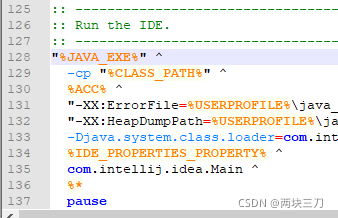
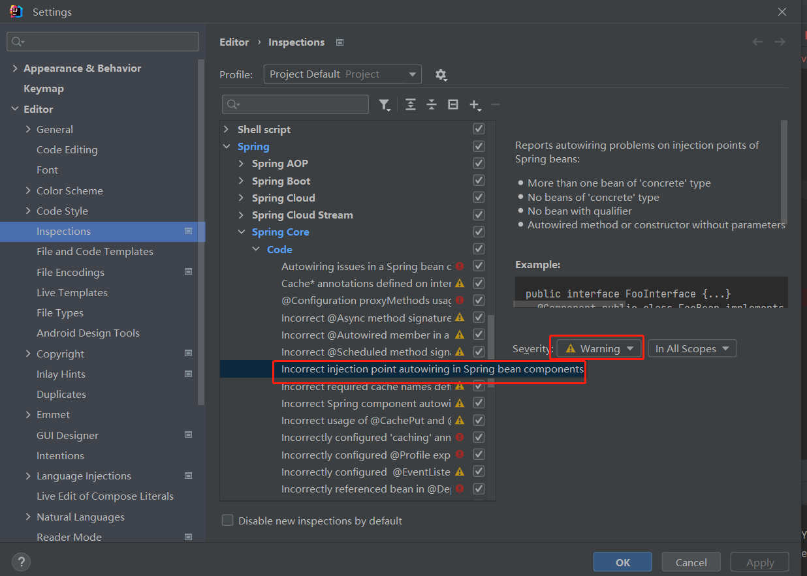

# IDEA

## 快捷键
[IntelliJ IDEA快捷键大全 + 动图演示](https://mp.weixin.qq.com/s/vWaDp-yVTMTdZbOX6H_3Kw)<br/>
虽然可以直接沿用Eclipse的快捷键，但是因为界面布局差异较大，也并不是所有都兼容，用起来还是别扭，所有建议使用标准的快捷键模式，这里以Windows为例。如果快捷键不生效一般是与其他软件冲突了。<br>
***设置Keymap***
```text
File -> Settings -> Keymap
```

***查找***

| **操作** | **描述** |
| :---: | :---: |
| Ctrl + Shift + F | 全局文件内容 |
| Ctrl + Shift + R | 全局文件内容 |
| Shift + Shift | 全局搜索类或者方法 |
| Ctrl + N | 查找class |
| Ctrl + Shift + N | 查找文件 |
| Ctrl + Shift + Alt + N | 查找方法 |

***编码***

| **操作** | **描述** |
| :---: | :---: |
| Ctrl + Y | 删除当前行 |
| Ctrl + D | 复制当前行 |
| Ctrl + Shift + U | 大小写切换 |
| Ctrl + / | 行注释 |
| Ctrl + Shift + / | 块注释 |
| Ctrl + H | 展示类的层级关系 |
| Ctrl + F12 | 展示类结构（构造函数，成员变量，方法等） |
| Shift + F6 | 重构/重命名 (包、类、方法、变量、甚至注释等) |
| Alt + Enter | 导入包 |
| Ctrl + Alt + O | 删除无用的import |
| Ctrl + Shift + F9 | 编译指定的文件或者模块 |

***跳转***

| **操作** | **描述** |
| :---: | :---: |
| Alt + 上方向键 | 跳到当前类的上一个方法位置 |
| Alt + 下方向键 | 跳到当前类的下一个方法位置 |
| Ctrl + Alt + 左方向键 | 后退到上一次光标的位置 |
| Ctrl + Alt + 右方向键 | 前进到上一次光标的位置 |
| Ctrl + G | 跳到指定行 |


***禁用 Shift+Shift*** 

对于中文用户，习惯了用Shift切换输入法，所以这个快捷键必须禁用，禁用方法如下图：



## 导入maven项目
```text
File -> New -> Module from Existing Sources
```

## UTF-8编码
版本：2022.1.2 <br/>
在D:\Program Files\JetBrains\IntelliJ IDEA 2022.1.2\bin\idea64.exe.vmoptions 添加启动参数 
```text
-Dfile.encoding=UTF-8
```

## FAQ
***遇到错误提示，不要急于关掉，要尽力去理解提示内容***

### IntelliJ IDEA 重装后无法启动 
* 问题描述 <br/>
  卸载2019版本重装2022版本后，双击IDEA无反应
* 原因 <br/>
  新版本不支持旧版本的破解方法，但是在卸载旧版的时候破解相关的文件没有移除，导致新版本无法启动
* 解决方案 <br/>
  - 第一步：查看错误信息
    ```text
    1) 在安装目录下找到D:\Program Files\JetBrains\IntelliJ IDEA 2019\bin\idea.bat文件;
    2) 然后编辑此文件，在最后一行添加 pause，用于报错后暂停；
    3) 双击此文件运行，就可以查看错误信息了;
    4) 看完错误信息，记得复原idea.bat
    ```
     <br/>
  - 第二步：删除残留文件夹
    ```text
    1）删除旧版文件夹 C:\Users\用户名.IntelliJIdea2019
    2）删除文件夹 C:\Users\用户名\AppData\Local\JetBrains
    3）删除文件夹C:\Users\用户名\AppData\Roaming\JetBrains
    ```
    上面步骤完成后再双击IDEA就能正常启动了！

### 创建接口时报错
* 问题描述<br/>
  Unable to parse template "Interface" Error message: Selected class file name 'xxx.java' mapped to not java file type 'Files supported via TextMate bundles' <br/>
* 解决方案 
  - 第一步： 在idea.exe.vmoptions和idea64.exe.vmoptions添加启动参数
    ```text
    -Djdk.util.zip.ensureTrailingSlash=false
    ```
    然后重启   
  - 第二步: 
    ```text
    Settings->Editor->File Types->Text 找到xxx.java删掉
    ```

### Could not autowire. No beans of 'xxx' type found.
* 问题描述<br/>
  在Idea的spring工程里，经常会遇到Could not autowire. No beans of 'xxxx' type found的错误提示。但程序的编译和运行都是没有问题的，这个错误提示并不会产生影响。但红色的错误提示在有些有强迫症的程序员眼里，多多少少有些不太舒服。
* 问题原因<br/>
  可能是我的idea版本落后，没有跟上spring boot 3.0 的步伐。
* 解决方案
  

## 执行 main 方法报错
* 问题描述
  ```java
  [ERROR] Command execution failed. org.apache.commons.exec.ExecuteException: Process exited with an error: 1 (Exit value: 1)
    at org.apache.commons.exec.DefaultExecutor.executeInternal (DefaultExecutor.java:404)
    at org.apache.commons.exec.DefaultExecutor.execute (DefaultExecutor.java:166)
    at org.codehaus.mojo.exec.ExecMojo.executeCommandLine (ExecMojo.java:804)
    at org.codehaus.mojo.exec.ExecMojo.executeCommandLine (ExecMojo.java:751)
    at org.codehaus.mojo.exec.ExecMojo.execute (ExecMojo.java:313)
    at org.apache.maven.plugin.DefaultBuildPluginManager.executeMojo (DefaultBuildPluginManager.java:137)
    at org.apache.maven.lifecycle.internal.MojoExecutor.execute (MojoExecutor.java:210)
    at org.apache.maven.lifecycle.internal.MojoExecutor.execute (MojoExecutor.java:156)
    at org.apache.maven.lifecycle.internal.MojoExecutor.execute (MojoExecutor.java:148)
    at org.apache.maven.lifecycle.internal.LifecycleModuleBuilder.buildProject (LifecycleModuleBuilder.java:117)
  ```
* 解决方案<br/>
  在pom.xml添加下面内容
  ```xml
    <build>
        <plugins>
            <plugin>
                <groupId>org.codehaus.mojo</groupId>
                <artifactId>exec-maven-plugin</artifactId>
                <version>3.1.0</version>
                <configuration>
                    <classpathScope>test</classpathScope>
                </configuration>
            </plugin>
        </plugins>
    </build>
  ```