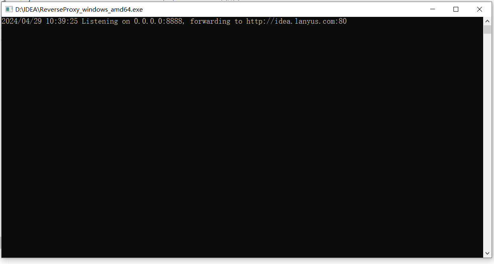

# JRebel
JRebel是一款JVM插件，它使得Java代码修改后不用重启系统，立即生效。IDEA上原生是不支持热部署的，一般更新了 Java 文件后要手动重启 Tomcat 服务器，修改才能生效；所以推荐使用 JRebel 插件进行热部署。

## 插件安装
打开IDEA，选择 File -> Settings -> Plugins -> 在右侧选择Marketplace，在搜索框输入jrebel -> 点击 Install

## 激活
1. 安装 ReverseProxy，[下载地址](https://github.com/ilanyu/ReverseProxy/releases)，选择对应系统的安装包（本文以 ReverseProxy_windows_amd64.exe 为例），双击运行如下图所示：
2. 获取 GUID，使用[在线GUID](https://www.guidgen.com/)生成（例如: 22afa264-5527-415c-8e69-cf998ccc114e）
3. 打开IDEA，选择 Help -> Jrebel -> Activation -> Team URL 填入 ```http://127.0.0.1:8888/22afa264-5527-415c-8e69-cf998ccc114e```，邮箱随便填一个 -> 点击 Change lincense
4. 关闭 ReverseProxy